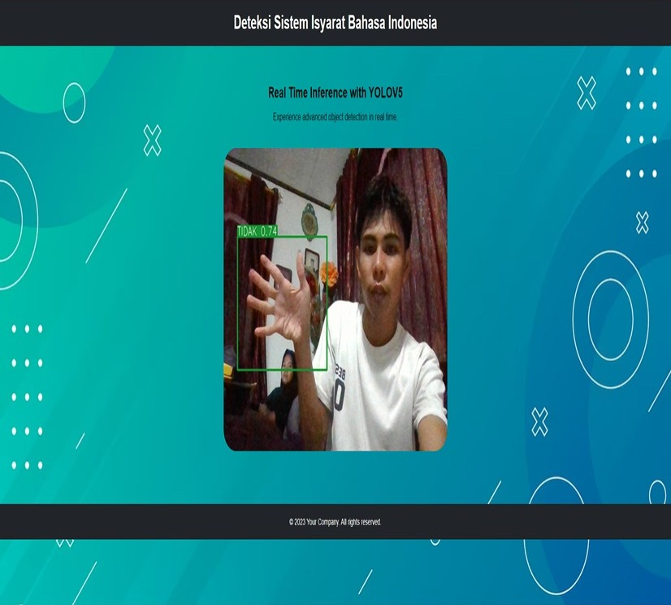

# Deteksi_Sistem_Isyarat_Bahasa_Indonesia_Menggunakan_Algoritma_YOLOv5
Tugas akhir untuk mendapatkan gelar S.KOM dari Universitas Muhammadiyah Sorong

Aplikasi ini dibuat untuk mendeteksi isyarat tangan secara real-time menggunakan webcam. Aplikasi mengimplementasikan algoritma YOLOv3 untuk melakukan deteksi objek pada setiap frame gambar dari webcam. 
## Tampilan Aplikasi



## Installasi

### Persyaratan

- Python 3.6+ 
- OpenCV 3.4+
- PyTorch 1.0+

### Langkah Installasi

1. Clone repo ini 

   ```bash
   git clone https://github.com/arfianaja/Deteksi_Sistem_Isyarat_Bahasa_Indonesia_Menggunakan_Algoritma_YOLOv5.git
   ```
2. Install requirements
    ```bash
    pip install -r requirements.txt
    ```
3. Jalankan aplikasi dengan perintah berikut:
    ```bash
    flask run
    ```

## Penggunaan
Buka aplikasi dan arahkan webcam ke tangan Anda. Aplikasi akan mendeteksi dan memvisualisasikan isyarat tangan dalam frame webcam.

## Kontribusi

Kontribusi dalam bentuk *pull request* adalah selalu dipersilakan, Untuk perubahan besar.

---
Dibuat oleh [Arpian](https://github.com/arfianaja)
---

## Kontak
Untuk pertanyaan atau saran, silakan hubungi saya di arpiiannn@gmail.com
